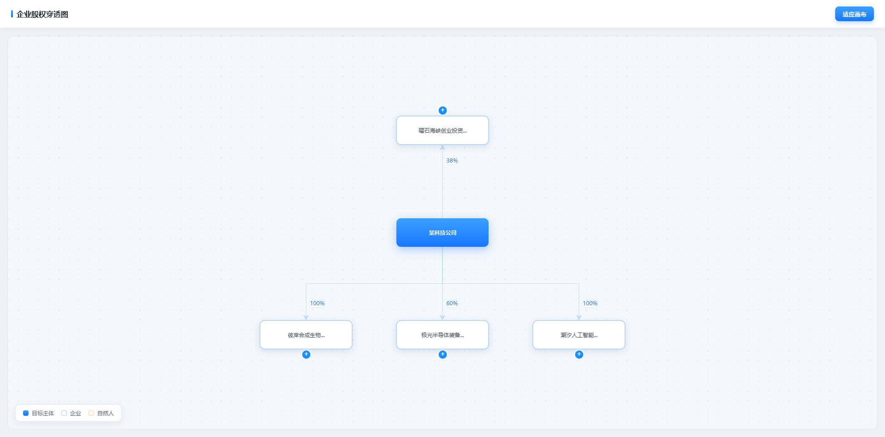
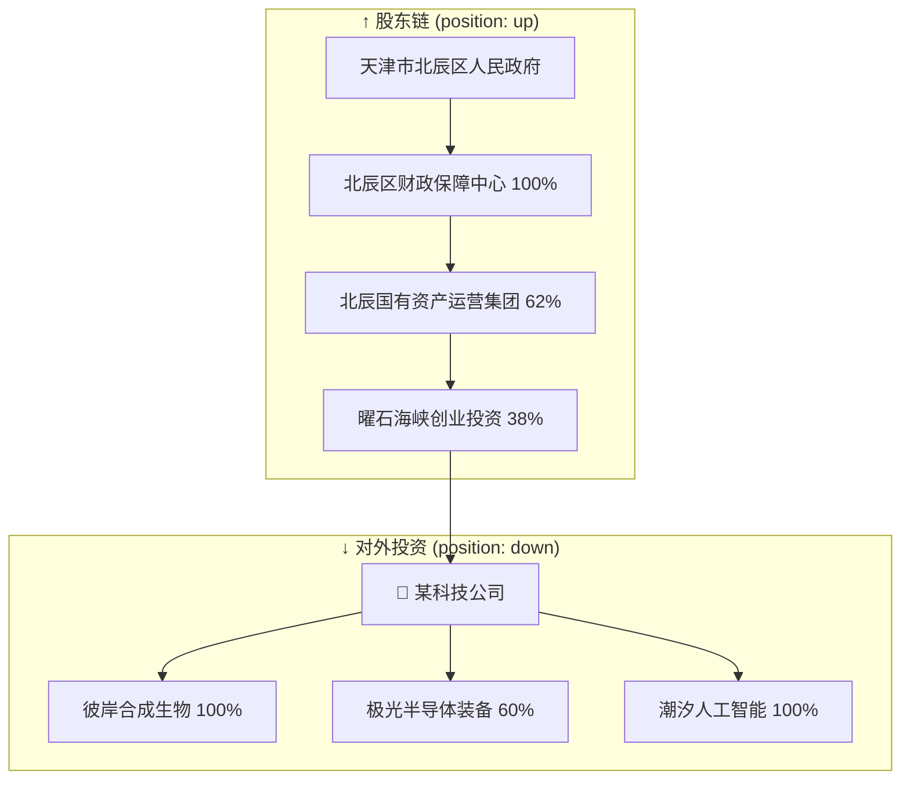
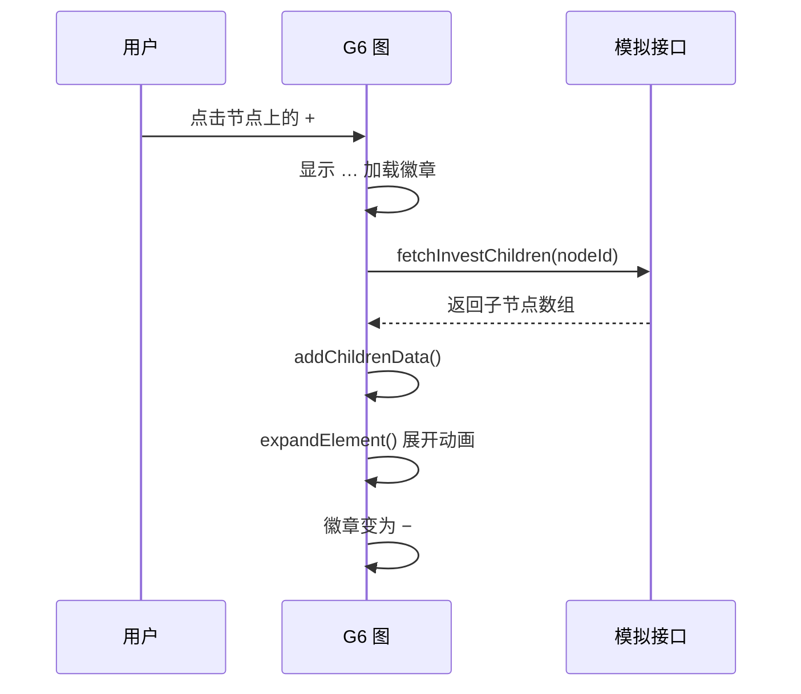
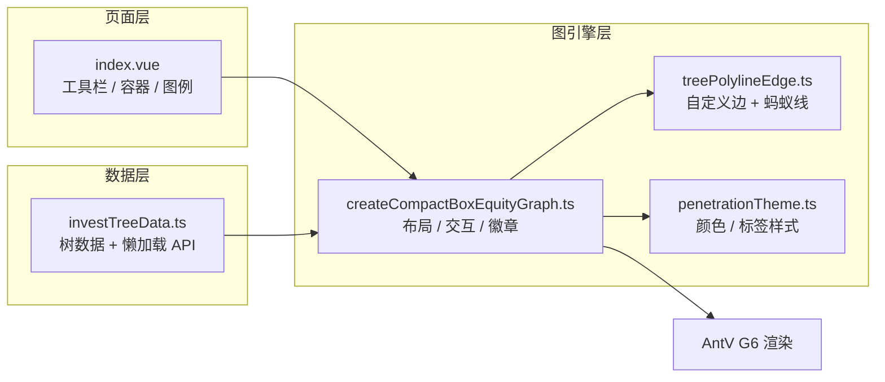

# 🕵️ 股权穿透图：从「谁投了谁」到一张会呼吸的关系网

> 一份带效果图的前端可视化实战教程 · Vue 3 + AntV G6 v5

---

## 开场：你在查什么？

想象你打开企查查，输入一家公司的名字，然后——

**上方**飞出一串股东：政府 → 基金 → 创投 → …  
**下方**展开对外投资：子公司 → 孙公司 → 自然人 …

这就是 **股权穿透图**：以目标公司为圆心，向上追「钱从哪来」，向下看「钱往哪去」。

本项目用 **Vue 3 + AntV G6 v5** 实现了企查查风格的交互式穿透图。接下来，我们用「侦探破案」的视角，拆解几个关键技术点。

---

## 效果图：首屏长什么样？

运行项目后访问 `http://localhost:5173`，你会看到：



**图里有什么？**

| 元素 | 含义 |
|------|------|
| 蓝色渐变节点 | 目标主体（你要查的那家公司） |
| 白底蓝框节点 | 普通企业 |
| 暖橙边框节点 | 自然人股东 |
| 边上的 `38%` | 持股比例 |
| 节点上的 `+` / `−` | 展开 / 折叠子节点 |

左下角图例、右上角「适应画布」、点阵背景——细节都在模仿真实商业产品的体验。

---

## 技术栈一览

```
Vue 3          → 页面框架
TypeScript     → 类型安全
Vite           → 极速开发
AntV G6 v5     → 图可视化引擎（布局、动画、交互）
```

项目结构很清晰，核心逻辑全在 `src/views/equity-compact-box/`：

```
equity-compact-box/
├── index.vue                      # 页面壳：工具栏 + 画布容器
├── investTreeData.ts              # 树形数据 + 懒加载模拟接口
├── createCompactBoxEquityGraph.ts # G6 图实例 + 全部交互
├── treePolylineEdge.ts            # 自定义边：折线 + 蚂蚁线
└── penetrationTheme.ts            # 企查查风主题色
```

---

## 第一案：数据不是「点+线」，而是一棵树 🌳

很多初学者第一反应：「节点数组 + 边数组，完事。」

股权穿透图不一样——它是 **以目标公司为根的树**，而且 **同一棵树里同时长向上和向下两个方向**。

### 数据模型

```ts
interface InvestTreeNodeData {
  name: string
  position?: 'up' | 'down'    // up=股东方，down=对外投资
  kind?: 'person' | 'company' | 'target'
  percent?: string             // 持股比例
  hasChildren?: boolean        // 还有未加载的子节点？
}
```

### 示意图：一棵树，两个方向



**关键洞察**：不是两棵独立的树，而是 **一棵树的 children 里混着 `up` 和 `down` 节点**，靠布局算法把它们分到根的两侧。

---

## 第二案：compact-box 布局——「挤一挤，都能放下」

G6 内置了 `compact-box` 布局，专为 **紧凑树形图** 设计。我们只需要告诉它三件事：

1. **方向**：垂直展开（`direction: 'V'`）
2. **尺寸**：每个节点 200×62 像素
3. **左右分流**：`getSide` 决定节点去左边还是右边

```ts
layout: {
  type: 'compact-box',
  direction: 'V',
  getWidth: () => 200,
  getHeight: () => 62,
  getVGap: () => 80,   // 层间距
  getHGap: () => 48,   // 同层间距
  getSide: (child) => getPosition(child) === 'up' ? 'left' : 'right',
}
```

### 布局效果图（概念示意）

```
                    ┌─ 曜石海峡创业投资 ─┐
                    │      38%          │
    [股东侧]  ←─────┤                   ├─────→  [投资侧]
                    │   🎯 某科技公司    │
                    └─────────┬─────────┘
              ┌───────────────┼───────────────┐
              ↓               ↓               ↓
         彼岸合成生物    极光半导体装备    潮汐人工智能
            100%             60%             100%
```

**为什么不用 Dagre？**  
Dagre 擅长「分层有向图」，但 compact-box 能在 **同一棵树** 里自然表达双向关系，而且节点折叠/展开时布局更稳定。

---

## 第三案：懒加载——「先给你看一层，剩下的按需加载」

真实业务里，一家公司的股权关系可能有几十层。首屏全量渲染？浏览器会哭。

### 策略

| 阶段 | 数据 | 用户看到 |
|------|------|----------|
| 首屏 | 根节点 + 上下各一层（L1） | 4 个节点，清爽 |
| 点击 `+` | 模拟 API 拉取下一层 | 节点出现 `…` 加载态 |
| 返回数据 | `addChildrenData` + `expandElement` | 子树展开，带动画 |

```ts
// 模拟异步接口，200ms 延迟
export async function fetchInvestChildren(parentId: string) {
  await new Promise((resolve) => setTimeout(resolve, 200))
  const parent = findTreeNode(parentId)
  return parent?.children?.map(toLazyChild) ?? []
}
```

### 懒加载流程（侦探笔记版）



### ⚠️ 踩坑警告：顺序不能乱！

这是团队真实踩过的坑，写进文档当「护身符」：

```
✅ 正确顺序：
   addChildrenData → expandElement → refreshBadges

❌ 错误顺序：
   addChildrenData → graph.render() → expandElement
   （中间 render 会打断展开流程，节点可能「闪一下就不见了」）
```

另外，全局只允许 **一个** 懒加载任务（`lazyLoadingNodeId` 锁），防止用户狂点 `+` 把接口打爆。

---

## 第四案：自定义边——竖横竖折线 + 蚂蚁线 🐜

默认的直线或曲线边，在树形图里容易「穿帮」——线从节点中间穿过去，标签和线叠在一起，丑。

我们自定义了 `compact-box-tree-polyline` 边类型。

### 路径算法：竖 → 横 → 竖

控制点 **只由两个端点坐标决定**，折叠/展开时边会平滑跟随，不会乱跳：

```ts
function treeOrthControlPoints(source, target) {
  const midY = (source[1] + target[1]) / 2
  return [
    [source[0], midY],   // 从源节点竖直下来
    [target[0], midY],   // 横线连过去
  ]                      // 再竖直到目标节点
}
```

### 边路径示意图

```
  源节点 (股东)
      │
      │  ← 第一段竖线
      ├──────────────┐
      │              │  ← 横线
      │         ┌────┤
      │         │    │  ← 第二段竖线
      │         ↓    │
      │    ┌─────────┴──┐
      │    │  38%       │  ← 标签在竖线右侧
      │    └────────────┘
      ↓
  目标节点
```

### 持股比例标签：放在「最后一段竖线」旁边

标签锚点落在路径约 55% 处（靠近子节点的那段竖线），再向右偏移 8px，白底圆角，不压线：

```ts
// 标签位置 = (第一段 + 横线 + 第三段×0.55) / 总长度
return (seg1 + seg2 + seg3 * 0.55) / total
```

### 悬浮蚂蚁线：边「活」起来了

鼠标悬停到节点或边时，关联边进入 `active` 状态，触发 **虚线流动动画**：

```ts
shape.attr({ lineDash: [6, 4] })
shape.animate(
  [{ lineDashOffset: 0 }, { lineDashOffset: -20 }],
  { duration: 450, iterations: Infinity }
)
```

**细节控注意**：折叠/展开动画期间要暂停蚂蚁线（`setCompactBoxVisibilityAnimating(true)`），否则虚线动画和布局动画会「打架」，画面抖动。

### 层级（zIndex）分工

| 元素 | zIndex | 为什么 |
|------|--------|--------|
| 普通边 | 1 | 默认垫底 |
| 激活边 | 3 | 高亮时盖住其他边 |
| 节点（含 ± 按钮） | 5 | 按钮永远可点，不被边挡住 |

---

## 第五案：± 折叠徽章——小圆点，大学问

每个可展开节点上有一个蓝色圆形徽章：

- **`+`**：已折叠，点击展开
- **`−`**：已展开，点击折叠
- **`…`**：正在懒加载

### 徽章位置规则

| 节点方位 | 徽章位置 |
|----------|----------|
| `position: 'up'`（股东） | 节点 **上方** |
| `position: 'down'`（投资） | 节点 **下方** |
| 根节点（目标主体） | **不显示**徽章 |

### 交互细节

- 监听 `node:pointerup` 而不是 `click`——避免和拖动画布冲突
- 点击徽章区域时，禁用 `drag-canvas` 和 `hover-activate`
- 用 `isPointerOnNodeBadge()` 向上遍历 DOM，识别 `badge-` 开头的 shape

---

## 第六案：主题与视觉——像企查查，但不抄作业

`penetrationTheme.ts` 集中管理视觉：

```ts
export const PENETRATION_THEME = {
  primary: '#1890ff',        // 主色
  person: '#fa8c16',         // 自然人暖橙
  targetFill: 'l(90) 0:#3aa0ff 1:#1677ff',  // 目标节点渐变
  edgeStroke: '#c4ddf7',     // 边线淡蓝
}
```

三种节点，三种性格：

| 类型 | 外观 | 场景 |
|------|------|------|
| `target` | 蓝底白字 + 阴影 | 「就是查它！」 |
| `company` | 白底蓝框 | 普通企业 |
| `person` | 暖橙边框 | 自然人股东 |

节点标签两行展示：`公司名` + `持股比例：xx%`。边上的标签是「备份展示」，双保险。

---

## 整体架构：谁负责什么？



页面只做三件事：

1. `onMounted` → 创建图实例
2. `ResizeObserver` → 容器尺寸变化时 `graph.resize()`
3. `onBeforeUnmount` → `graph.destroy()` 释放资源

---

## 快速上手

```bash
# 克隆 / 进入项目
cd equityOwnershipStructureDiagram

# 安装依赖
npm install

# 启动开发服务器
npm run dev

# 浏览器打开
# http://localhost:5173
```

试试这些操作：

1. **滚轮缩放** — 画布 zoom
2. **拖拽空白处** — 平移画布
3. **点击 `+`** — 懒加载展开子节点
4. **悬停节点** — 看蚂蚁线流动
5. **点击「适应画布」** — 一键 fitView

---

## 知识小结：五个「啊哈时刻」

| # | 技术点 | 一句话 |
|---|--------|--------|
| 1 | 树形数据 + `getSide` | 一棵树表达双向股权关系 |
| 2 | compact-box 布局 | 垂直紧凑，左右分流 |
| 3 | 懒加载 + 折叠 | 首屏轻量，按需展开 |
| 4 | 自定义折线边 | 竖横竖路径 + 边标签 + 蚂蚁线 |
| 5 | zIndex 分层 | 边不挡按钮，按钮永远可点 |

---

## 进阶方向

想继续打磨？可以考虑：

- **接入真实 API**：替换 `fetchInvestChildren`，保留 `hasChildren` 协议
- **搜索定位**：工具栏搜索 → `graph.focusElement(id)` 高亮跳转
- **节点详情**：点击节点打开侧栏，展示工商信息
- **导出图片**：`graph.toDataURL()` 生成穿透图快照
- **路径高亮**：从根到某节点的完整持股链高亮

---

## 延伸阅读

- [AntV G6 官方文档](https://g6.antv.antgroup.com/)
- [compact-box 布局说明](https://g6.antv.antgroup.com/manual/layout/compact-box)
- 项目内更详细的实现说明：`src/views/equity-compact-box/README.md`

---

> 🎬 **结语**  
> 股权穿透图看起来是「画几个框连几条线」，背后却是数据建模、布局算法、懒加载时序、自定义渲染、动画协调的一整套工程。  
> 希望这份文档帮你把「看起来酷」和「写得稳」之间的距离，缩短一点点。

*文档版本：2025-06 · 基于 equityOwnershipStructureDiagram 项目*
