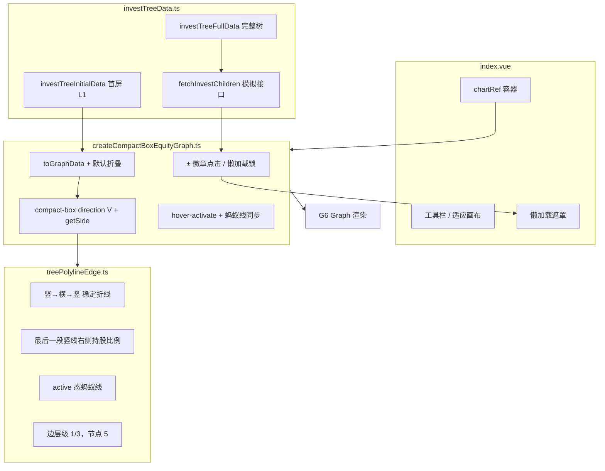

# 股权穿透图实现说明

本文档说明 `equity-compact-box` 模块如何用 [AntV G6 v5](https://g6.antv.antgroup.com/) 的 **compactBox** 布局实现企查查风格的上下双向股权穿透树图，包括数据模型、懒加载、自定义边、折叠展开、悬浮蚂蚁线与页面交互。

## 目录结构

```
equity-compact-box/
├── index.vue                      # 页面：工具栏、图表容器、懒加载遮罩
├── investTreeData.ts              # 树形投资关系数据与懒加载模拟接口
├── createCompactBoxEquityGraph.ts # G6 图实例创建与全部交互逻辑
├── treePolylineEdge.ts            # 自定义边：稳定折线 + 边标签 + 蚂蚁线 + 层级
├── penetrationTheme.ts            # 企查查式主题色与节点/边标签样式
└── README.md                      # 本文档
```

路由：`/equity-compact-box`（`src/router/index.ts`）

## 整体架构



页面在 `onMounted` 时调用 `createCompactBoxEquityGraph(container, undefined, { onLazyLoadingChange })` 创建图实例；`ResizeObserver` 负责容器自适应；卸载时 `graph.destroy()` 释放资源。

## 业务场景

以**目标公司**（根节点）为中心：

- **上方（`position: 'up'`）**：投资方 / 股东链，布局在根节点左侧上方区域
- **下方（`position: 'down'`）**：被投资方 / 对外投资，布局在根节点右侧下方区域

这与传统「只有向下」的单向股权树不同，compactBox 通过 `getSide` 在同一棵树里同时表达双向关系。

## 数据模型

### 树形结构

```ts
interface InvestTreeNodeData {
  name: string
  position?: 'up' | 'down'   // 相对方位
  kind?: 'person' | 'company' | 'target'
  percent?: string             // 持股比例，展示在节点标签与边标签
  hasChildren?: boolean        // 懒加载标记：还有未请求的子节点
}

interface InvestTreeChild {
  id: string
  data: InvestTreeNodeData
  children?: InvestTreeChild[]
}

interface InvestTreeData {
  id: string
  data: { name: string; kind: 'target' }
  children: InvestTreeChild[]
}
```

### 两份数据

| 变量 | 用途 |
|------|------|
| `investTreeFullData` | 模块内完整模拟数据源（含 L2～L4） |
| `investTreeInitialData` | 首屏仅根节点 + 上下各一层（L1） |
| `fetchInvestChildren(parentId)` | 模拟异步接口，延迟 600ms 返回下一层 |

`toLazyChild` 在导出子节点时写入 `hasChildren: !!(child.children?.length)`，供前端判断是否需要懒加载。

### 树 → 图数据

```ts
const data = treeToGraphData(tree)

// 有子节点（已加载或 hasChildren）的节点默认折叠
for (const node of data.nodes ?? []) {
  if (canShowExpandBadge(node)) {
    node.style = { ...node.style, collapsed: true }
  }
}

// 边统一走 bottom → top 端口，并带上持股比例边标签
data.edges = data.edges.map((edge) => ({
  ...edge,
  sourcePort: 'bottom',
  targetPort: 'top',
  style: { labelText: percent, ...EDGE_PERCENT_LABEL_STYLE },
}))
```

**要点**：在数据阶段设置 `style.collapsed: true`，避免首屏渲染后再批量 `collapseElement` 引发 zIndex / 布局异常。

## 布局：compact-box

```ts
layout: {
  type: 'compact-box',
  direction: 'V',
  getId: (d) => String(d?.id ?? ''),
  getWidth: () => 200,
  getHeight: () => 62,
  getVGap: () => 80,
  getHGap: () => 48,
  getSide: (child) => getPosition(child) === 'up' ? 'left' : 'right',
}
```

| 配置项 | 值 | 说明 |
|--------|-----|------|
| `direction: 'V'` | 垂直紧凑树 | 根在中部，子节点向上下展开 |
| `getSide` | up→left, down→right | 投资方与对外投资分到根节点两侧 |
| `getVGap / getHGap` | 80 / 48 | 层间距与同层节点间距 |

节点尺寸固定为 **200×62**，圆角 **4px**。

## 节点样式与 ± 折叠徽章

### 视觉（`penetrationTheme.ts`）

企查查式主色 `#1890ff`：

- **目标公司**：蓝底白字
- **其他节点**：白底蓝框，标签两行：`名称` + `持股比例：xx%`
- **± 徽章**：蓝色圆形按钮，白字 `+` / `−` / `…`

### 徽章规则（`createCompactBoxEquityGraph.ts`）

| 条件 | 行为 |
|------|------|
| `kind === 'target'` | 根节点不显示徽章 |
| `children.length > 0` 或 `hasChildren === true` | 显示 ± |
| `position === 'up'` | 徽章在节点**上方** |
| `position === 'down'` | 徽章在节点**下方** |
| 懒加载进行中 | 当前节点显示 `…`，全局禁止再次点击 |

### 点击流程

监听 `node:pointerup`（不用 `click`，避免与拖动画布冲突）：

```
点击 ±
  ├─ 懒加载进行中 → 忽略
  ├─ 当前已展开 → collapseElement
  ├─ 未加载且有 hasChildren → 懒加载分支
  │    ├─ setLazyLoading(true) + 页面遮罩
  │    ├─ fetchInvestChildren
  │    ├─ addChildrenData
  │    ├─ patchTreeEdgePorts
  │    └─ expandElement（不再额外 render）
  └─ 已加载子节点 → expandElement
```

**懒加载关键顺序**（曾踩坑）：

1. `addChildrenData`
2. **立即** `expandElement`
3. 最后 `refreshBadges`

中间插入 `graph.render()` 或过早 `draw()` 会打断展开流程。

**并发限制**：全局 `lazyLoadingNodeId` 同时只允许一个懒加载任务。

## 自定义边：compact-box-tree-polyline

文件：`treePolylineEdge.ts`

### 路径算法

竖 → 横 → 竖正交折线，控制点**仅由端点坐标**计算：

```ts
function treeOrthControlPoints(source, target) {
  const midY = (source[1] + target[1]) / 2
  return [
    [source[0], midY],
    [target[0], midY],
  ]
}
```

不使用 orth 路由重算，折叠/展开时边随端点平滑移动，避免跳动。

### 边持股比例标签

锚点落在路径**最后一段竖线**（靠近子节点）约 55% 处：

```ts
(seg1 + seg2 + seg3 * 0.55) / total
```

配合 `labelOffsetX: 8`、`textAlign: 'left'`，标签显示在竖线**右侧**，白底避免与线重叠。

### 悬浮蚂蚁线

边处于 G6 `active` 状态时：

- `lineDash: [6, 4]` + `lineDashOffset` 循环动画
- 线宽 2、颜色 `#1890ff`
- 折叠/展开/懒加载期间通过 `setCompactBoxVisibilityAnimating(true)` 暂停

### 层级（zIndex）

| 元素 | zIndex | 说明 |
|------|--------|------|
| 普通边 | 1 | 默认 |
| 激活边 | 3 | 盖住其他边，但不盖住节点 |
| 节点（含 ±） | 5 | 折叠按钮始终可点 |

不使用 `frontElement`，避免边盖住徽章。

## 交互行为

```ts
behaviors: [
  { type: 'drag-canvas', enable: (e) => !isPointerOnNodeBadge(e) },
  { type: 'zoom-canvas', sensitivity: 0.15 },
  {
    type: 'hover-activate',
    degree: 1,
    enable: (e) => !badge && !lazyLoading && !visibilityAnimating,
    onHover / onHoverEnd → syncAllCompactBoxTreePolylineEdges,
  },
]
```

`hover-activate` 的 `degree: 1` 会高亮当前节点、相邻节点及关联边；边进入 `active` 后触发自定义边的蚂蚁线与层级同步。

## 页面层（index.vue）

| 功能 | 实现 |
|------|------|
| 适应画布 | `graph.fitView()` |
| 容器自适应 | `ResizeObserver` → `graph.resize` |
| 懒加载遮罩 | `onLazyLoadingChange` → `rgba(255,255,255,0.88)` 全屏 loading |
| 水印 | CSS 伪元素斜向「穿透图」 |
| 搜索框 | 占位 UI，暂未接入 |

## 与 equity（Dagre）版对比

| 维度 | equity（Dagre） | 本模块（equity-compact-box） |
|------|-----------------|------------------------------|
| 路由 | `/equity` | `/equity-compact-box` |
| 布局 | `antv-dagre` TB | `compact-box` V + getSide |
| 方向 | 上股东 / 下投资（分层） | 同树双向 up/down |
| 数据 | 扁平 nodes + edges | 单根树 + treeToGraphData |
| 子节点 | 全量加载 | 首屏 L1 + 懒加载 |
| 折叠 | 自定义 visibility | G6 内置 collapseElement |
| 边 | hover-ant-polyline + orth | compact-box-tree-polyline 端点定控制点 |
| 风格 | 政务蓝灰 | 企查查 #1890ff |

## 本地运行

```bash
npm run dev
# 浏览器打开 http://localhost:5173/equity-compact-box
```

## 扩展建议

1. **接入真实 API**：将 `fetchInvestChildren` 替换为后端分页接口，保留 `hasChildren` 协议。
2. **搜索定位**：工具栏搜索框对接企业检索，命中后 `graph.focusElement(id)`。
3. **节点详情**：`node:click` 打开侧栏展示工商信息。
4. **导出图片**：`graph.toDataURL()` 生成穿透图快照。
